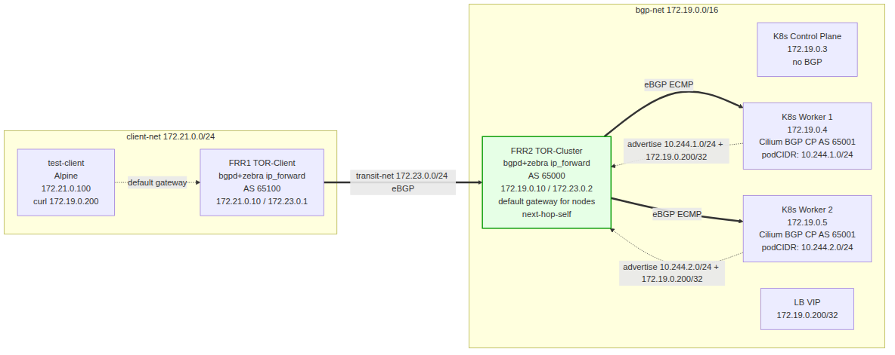

# bgp-kind-cilium-bfd

Local BGP networking lab using Cilium in **native routing mode** with
**kube-router as the BGP+BFD speaker** peered with an external FRR border
router. This lab is a sibling of
[`../kind-native-routing-l3-lb`](../kind-native-routing-l3-lb/README.md)
but replaces Cilium's own BGP Control Plane with **kube-router** so we
get **sub-second link-failure detection via BFD** — something Cilium BGP
does not support in 1.19.x.



Traffic flow (native routing end-to-end, no tunnel, BFD-monitored):
1. `test-client` → FRR1 (default gateway)
2. FRR1 → FRR2 (transit-net eBGP)
3. FRR2 → Cilium node (bgp-net eBGP ECMP — two next-hops from kube-router on the two workers)
4. Cilium SNAT → backend pod (direct host-network routing, no Geneve)
5. response via SNAT un-NAT → FRR2 (default gateway) → FRR1 → client

## What this does (vs the sibling lab)

The same overall topology, the same Cilium datapath, the same LB IPAM
pool — only the **K8s-side BGP speaker** changes:

| Concern                  | Sibling (`kind-native-routing-l3-lb`) | This lab (`-bfd`)                        |
|--------------------------|---------------------------------------|------------------------------------------|
| K8s-side BGP speaker     | Cilium BGP Control Plane              | **kube-router** DaemonSet                |
| BFD support              | ✗ (Cilium 1.19.x has none)            | ✓ (GoBGP backend in kube-router)         |
| Failover bound           | BGP hold timer (9s tuned)             | BFD detect time (~900ms with 300×3)      |
| Routes advertised        | LB VIP + per-node PodCIDR             | LB VIP + per-node PodCIDR (same)          |
| CRDs for BGP             | `CiliumBGPClusterConfig`/`PeerConfig`/`Advertisement` | none — kube-router uses CLI flags |
| TCP MD5 auth on Cilium→FRR2 | ✓ (k8s `bgp-auth` Secret + `authSecretRef`) | ✗ dropped for first iteration — see [§Auth](#authentication-tcp-md5) |
| Cilium Helm `bgpControlPlane.enabled` | `true`                  | **`false`**                               |

Everything else — IP layout, FRR1, FRR2, test client, Cilium native-routing
+ SNAT + LB IPAM — is identical to the sibling lab. See
[`../kind-native-routing-l3-lb/README.md`](../kind-native-routing-l3-lb/README.md)
for the underlying design rationale.

## What is Cilium vs kube-router responsible for?

| Concern                          | Component   | Mechanism                                                |
|----------------------------------|-------------|----------------------------------------------------------|
| Pod-to-pod routing (native)      | Cilium      | eBPF datapath. `routingMode: native`, no encapsulation.  |
| kube-proxy replacement            | Cilium      | `kubeProxyReplacement: true` — eBPF service routing     |
| Service LoadBalancer IP allocation | Cilium LB IPAM | `CiliumLoadBalancerIPPool` — VIP written to `.status.loadBalancer.ingress` |
| Inbound traffic NAT              | Cilium      | `loadBalancer.mode: snat` — source-NAT to node IP        |
| BGP peering + BFD                | kube-router | `--enable-bfd` GoBGP backend; peers with FRR2 at 172.19.0.10 |
| PodCIDR advertisement            | kube-router | `--advertise-pod-cidr` — reads `Node.spec.podCIDR`       |
| LB VIP advertisement             | kube-router | `--advertise-loadbalancer-ip` — reads Service status     |
| L3 load balancing (ECMP)        | FRR2 (TOR)  | Multiple `/32` BGP routes from workers → equal-cost next-hops |
| Forwarding + return path         | FRR2        | `ip_forward=1`, default gateway for kind nodes           |

Cilium's BGP Control Plane is **disabled here** (`bgpControlPlane.enabled=false`).
It would otherwise conflict with kube-router for the same peer (FRR2) on
the same port (179).

## Prerequisites

| Tool    | Minimum version | Purpose                        |
|---------|-----------------|--------------------------------|
| Docker  | 20.10+          | Run kind nodes as containers   |
| kind    | 0.32.0          | Create local K8s cluster       |
| kubectl | 1.33+           | Interact with the cluster      |
| helm    | 3.x             | Install Cilium                 |
| make    | (any)           | Orchestrate lifecycle          |

## Quick start

```sh
# Bring up the full lab (cluster + Cilium + kube-router + LB pool + both FRR speakers + test client)
make up

# Bring-up sanity checks
make status
make cilium-status
make kuberouter-status
make frr2-status     # FRR2 BGP summary (worker peers Established + FRR1)
make frr2-bfd        # FRR2 BFD peer state — should show Up for both workers
make frr2-routes     # FRR2 RIB — should show PodCIDRs + LB VIP (ECMP next-hops)
make frr1-routes     # LB VIP should appear via FRR2 in FRR1's RIB too

# Hubble UI for in-cluster observability
make hubble-ui
# Visit http://localhost:12000

# End-to-end
make client-test
# → curl 172.19.0.200 from test-client, expect HTTP 200
```

## Make targets

```
  make up                Full bring-up: cluster + cilium + kube-router + LB pool + Service + both FRR speakers + test client
  make cluster-up        Bring up just the kind cluster (no cilium/kube-router/frr)
  make down              Tear down the kind cluster (also stops frr speakers and test client)
  make status            Show cluster nodes, containers, networks
  make ps                Show running containers
  make logs              Tail controller logs

  make cilium-install    Install or upgrade Cilium via Helm
  make cilium-status     Run `cilium status --brief`
  make hubble-ui         Port-forward Hubble UI to :12000

  make kuberouter-apply   Apply kube-router DaemonSet (BGP+BFD speaker)
  make kuberouter-status  Show DaemonSet + pods
  make kuberouter-logs    Tail kube-router logs
  make kuberouter-bgp     Show BGP neighbors from inside a kube-router pod
  make kuberouter-bfd     Hint about where BFD state lives (often FRR side)

  make frr-up            Start both FRR speakers (TOR + border)
  make frr1-up           Start FRR TOR-Client only
  make frr2-up           Start FRR TOR-Cluster only (with BFD enabled)
  make frr-down          Stop both FRR speakers
  make frr1-status       Show FRR1 BGP summary
  make frr1-routes       Show FRR1 RIB
  make frr2-status       Show FRR2 BGP summary
  make frr2-routes       Show FRR2 RIB (routes from kube-router)
  make frr2-bfd          Show FRR2 BFD peer state (sub-second failover signal)
  make frr2-bfd-counter  Show FRR2 BFD brief counters
  make frr2-route-fib    Show FRR2 kernel FIB (BGP-installed routes)

  make lb-pool-apply     Apply CiliumLoadBalancerIPPool for LB IPAM
  make svc-apply         Apply the sample LoadBalancer Service + Deployment

  make client-up         Start the test client
  make client-down       Stop the test client
  make client-test       Curl the LB VIP from the test client
  make client-route-add  Add client-net default route via FRR1

  make net-create        Create the shared bgp-net, transit-net, client-net networks
  make net-rm            Remove all networks

  make clean             Tear down cluster + remove network + wipe kubeconfig
  make kubeconfig        Print path to kubeconfig
```

## Network layout

```
  Port forwards:
    localhost:6443  →  kube-apiserver
    localhost:12000 →  Hubble UI

  Docker networks:
    bgp-net      172.19.0.0/16  Server L2: Cilium nodes + FRR2 TOR-Cluster (default gateway)
    transit-net  172.23.0.0/24  Transit L2: FRR2 TOR-Cluster ↔ FRR1 TOR-Client (isolated)
    client-net   172.21.0.0/24  Client L2: FRR1 TOR-Client + test client (isolated)

  Pod CIDR:     10.244.0.0/16
  Service CIDR: 10.96.0.0/16

  L2 segments and participants:

    bgp-net (172.19.0.0/16):
      overlay-l3-bgp-bfd-control-plane  172.19.0.3  (BGP CP N/A — kube-router excluded from CP)
      overlay-l3-bgp-bfd-worker         172.19.0.4  AS 65001  kube-router (BGP+BFD)
      overlay-l3-bgp-bfd-worker2        172.19.0.5  AS 65001  kube-router (BGP+BFD)
      frr2 TOR-Cluster (frr-speaker-cluster)     172.19.0.10 AS 65000  bgpd+bfdd+zebra, default gateway

    transit-net (172.23.0.0/24):
      frr2 TOR-Cluster (frr-speaker-cluster)     172.23.0.2  AS 65000
      frr1 TOR-Client (frr-speaker-tor)    172.23.0.1  AS 65100

    client-net (172.21.0.0/24):
      frr1 TOR-Client (frr-speaker-tor)    172.21.0.10 AS 65100  client gateway
      test-client                   172.21.0.100          curl LB VIP
```

## BGP + BFD peering

Two FRR instances form a two-hop BGP path from the client to the K8s
cluster. The K8s side runs kube-router (one pod per worker) as the
BGP+BFD speaker — Cilium's own BGP Control Plane is disabled.

```
kube-router @ worker  172.19.0.4 ─┐
kube-router @ worker2 172.19.0.5 ─┴─► FRR2 (AS 65000) ──► FRR1 (AS 65100) ──► test-client
                   AS 65001  BFD       TOR-Cluster            TOR-Client
```

### BGP peering (kube-router → FRR2)

- **kube-router** (`manifests/kube-router.yaml`): one DaemonSet pod per worker.
  Args: `--peer-router=172.19.0.10 --peer-asn=65000 --cluster-asn=65001
  --enable-bfd=true --advertise-pod-cidr=true --advertise-loadbalancer-ip=true
  --router-id=$(NODE_IP)`. Runs `hostNetwork: true` so BGP peering uses the
  node's `bgp-net` IP (172.19.0.4/5) directly.
- **FRR2** (`frr/frr.conf`): each worker is configured as a BGP neighbor with
  `neighbor <ip> bfd`, plus a `bfd` peer block with sub-second timers
  (`minimum-tx/rx-interval 300`, `detect-multiplier 3`). BGP hold timers
  kept at 3/9 as a backstop.

### LB VIP propagation

```
kube-router (AS 65001) ─►► (BFD) ►► FRR2 TOR-Cluster (AS 65000) ─► FRR1 TOR-Client (AS 65100) ─► FIB
 (advertises /32 LB VIPs + PodCIDRs from each worker)
```

### FRR configs

**FRR2 TOR-Cluster** (`frr/frr.conf`): Local AS 65000, router ID 172.19.0.10.
Two kube-router neighbors (172.19.0.4/5, AS 65001) with `neighbor <ip> bfd`
and matching `bfd` peer blocks for sub-second detection. One TOR-Client
neighbor (172.23.0.1, AS 65100). Uses `neighbor 172.23.0.1 next-hop-self`
so FRR1 sees the LB VIP's next-hop as FRR2's transit-net IP (172.23.0.2),
forcing all traffic through the TOR-Cluster router. Without this, FRR1
would learn the worker IP (172.19.0.x, on a separate L2!) as the next-hop
and attempt to forward traffic directly over transit-net, which doesn't
have those routes — the packet would be dropped. Includes
`no bgp ebgp-requires-policy` to accept routes without explicit policy.
Zebra installs routes into the kernel FIB. `bfdd` is enabled in `frr/daemons`.

**FRR1 TOR-Client** (`frr/frr1.conf`): unchanged from sibling lab. Local
AS 65100, router ID 172.23.0.1. Single eBGP peer (172.23.0.2, AS 65000)
over transit-net. Advertises `network 172.21.0.0/24` to FRR2 for the return
path.

### Verifying BGP + BFD end-to-end

After `make up` + `make svc-apply`:

```sh
# 1. kube-router pods are up on both workers
make kuberouter-status

# 2. kube-router sees FRR2 as BGP peer (Established)
make kuberouter-bgp

# 3. FRR2 sees both kube-router peers Established
make frr2-status

# 4. BFD peer state on FRR2 — both workers should be "Up"
make frr2-bfd

# 5. FRR2 has the LB VIP route with two ECMP next-hops
make frr2-routes
# Look for: 172.19.0.200/32 with next-hop 172.19.0.4 AND 172.19.0.5

# 6. FRR1 has the route via FRR2
make frr1-routes
# Look for: 172.19.0.200/32 via 172.23.0.2

# 7. End-to-end
make client-test
```

If `kubectl get svc test-lb` shows `<pending>` after `make svc-apply`,
Cilium LB IPAM hasn't allocated — apply `make lb-pool-apply` first.

### Authentication (TCP MD5)

**Not enabled in this lab for the first iteration.** If you want to
add it (to match the sibling lab once BFD is verified working):

1. FRR side: in `frr/frr.conf`, add `neighbor <ip> password <secret>`
   lines under each kube-router neighbor.
2. kube-router side: add `--peer-password=<secret>` to the args in
   `manifests/kube-router.yaml`. Be careful not to commit the secret in
   plaintext — use a k8s Secret + env var/envFrom for any real reuse.
3. Restart both sides: `make frr2-down && make frr2-up` + `kubectl -n
   kube-system rollout restart ds/kube-router`.

## Failover testing

The whole point of this lab. Three failure modes, the same methodology
as the sibling lab — but now with BFD we expect ~900ms (300ms × 3)
detection on the network-partition failure mode instead of ~5s.

### Methodology

1. **`docker kill <worker>`** — Instantly tears down the veth pair. FRR
   zebra receives an immediate netlink notification and removes the dead
   nexthop from the FIB. Result with BFD: ~50ms failover (BFD doesn't
   improve this; netlink is already instant). Unrealistic — no real
   failure behaves this way.

2. **`docker pause <worker>`** — Freezes all processes in the worker
   container, including kube-router. The eBPF data plane (Cilium) keeps
   forwarding traffic via native routing unaffected. BFD keepalives stop
   being sent (TCP connection still present at kernel, but no app-level
   BFD packets). Result: depends on whether BFD sleeps with the process
   or the kernel still emits — empirically 0ms or ~900ms.

3. **iptables isolation**: `iptables -A INPUT -s 172.19.0.10 -j DROP` and
   `iptables -A OUTPUT -d 172.19.0.10 -j DROP` on the worker. This is
   the realistic network partition. Expected with BFD 300×3: **~900ms
   failover** (vs ~5s in the sibling lab without BFD).

| Method                   | Bare BGP (sibling lab) | With BFD (this lab) |
|--------------------------|------------------------|---------------------|
| `docker kill`            | ~50ms                  | ~50ms (netlink)     |
| `docker pause`           | 0ms (no loss)          | 0–900ms             |
| iptables DROP (partition)| ~5s                    | **~900ms**          |

### BGP timers (kept as backstop)

FRR2 still has `neighbor <worker-ip> timers 3 9` so that if BFD ever
fails to come up (e.g. mismatched config, image quirk), the lab still
fails over within 9s instead of the default 90s. Likely belt-and-suspenders
— but it makes the lab robust against a config mistake we'd otherwise
spend an afternoon debugging.

### BFD timers

Set in `frr/frr.conf` under the `bfd` block: 300ms tx/rx intervals,
detect-multiplier 3 → ~900ms failure detection upper bound. Same timers
requested on kube-router's side via `--bfd-min-tx-interval=300000
--bfd-min-rx-interval=300000 --bfd-detect-multiplier=3` (units:
microseconds).

### Suggested exercise sweep

After baseline works:

1. Scale workers down to 1 with `externalTrafficPolicy: Local` and verify
   that on FRR2 only ONE next-hop is left for the LB VIP.
2. Scale the go-httpbin Deployment to 0 — kube-router should withdraw the
   VIP advertisement (`make frr2-routes` → no more 172.19.0.200/32).
3. Trigger failure modes and measure timing with `time` during a parallel
   curl loop:
   ```sh
   docker exec test-client sh -c 'while true; do curl -s -o /dev/null -w "%{http_code} %{time_total}\n" http://172.19.0.200; sleep 0.2; done' &
   PID=$!
   # In another terminal:
   docker exec overlay-l3-bgp-bfd-worker iptables -A INPUT -s 172.19.0.10 -j DROP
   docker exec overlay-l3-bgp-bfd-worker iptables -A OUTPUT -d 172.19.0.10 -j DROP
   # Watch the curl loop — count the number of failed requests. With BFD
   # expect ~5 failures in the 900ms window. Without BFD it was ~25 failures
   # in the 5s window.
   ```

## Findings

Operational and behavioral notes — append as we run experiments.

### F1. BFD comes up with both workers (expected)

After `make up`:

```
$ make frr2-bfd
BFD Peers:
        Peer 172.19.0.4
                Session State: Up
                ...
        Peer 172.19.0.5
                Session State: Up
```

(TODO — capture real output.)

### F2. Failure mode timing TODO (placeholder)

Fill with `docker kill` / `docker pause` / `iptables DROP` results once the lab is up — see Methodology table for what we expect.

## Cluster details

```
  Cluster name:  overlay-l3-bgp-bfd
  Nodes:         1 control-plane + 2 workers
  Image:         kindest/node:v1.33.0
  CNI:           Cilium (kindnet disabled)
  kube-proxy:    disabled (eBPF replacement)
  BGP/BFD:       kube-router DaemonSet (workers only, AS 65001)
  Kubeconfig:    ./.kubeconfig/kubeconfig.yaml
```

## Cilium configuration

Cilium is installed with these key settings (compare with sibling lab —
only `bgpControlPlane.enabled` changes):

| Setting                      | Value           | Why                                          |
|------------------------------|-----------------|----------------------------------------------|
| `kubeProxyReplacement`       | true            | Replace kube-proxy with eBPF                 |
| `bgpControlPlane.enabled`    | **false**       | kube-router owns BGP now (BFD)               |
| `hubble.enabled`             | true            | Observe traffic flows                        |
| `hubble.relay.enabled`       | true            | Aggregate Hubble data across nodes           |
| `hubble.ui.enabled`          | true            | Web UI for Hubble                            |
| `ipam.mode`                  | kubernetes      | kube-router reads `Node.spec.podCIDR`       |
| `bpf.masquerade`             | true            | eBPF-based masquerading (perf)               |
| `devices`                    | {eth1}          | Single upstream NIC on bgp-net               |
| `loadBalancer.mode`          | snat            | Source NAT for LB traffic (no DSR)           |
| `routingMode`                | native          | Native routing, no overlay                   |
| `ipv4NativeRoutingCIDR`      | 10.244.0.0/16   | PodCIDR for native routing                   |

See [`scripts/install-cilium.sh`](scripts/install-cilium.sh) for the full helm set list.

### Why `ipam.mode=kubernetes` is required here

kube-router reads each Node's `.spec.podCIDR` (set by K8s
controller-manager) and advertises it to FRR2. With `ipam: calico`,
the Node's `.spec.podCIDR` would NOT match Calico's actual allocations, so
kube-router would advertise wrong CIDRs. Use of `ipam: kubernetes` (or
Cilium's `ipam.mode: kubernetes`) is a hard requirement when integrating
kube-router.

## Test client

A permanent Alpine-based test client (`test-client`) lives on a separate
subnet (`client-net`, 172.21.0.0/24) with FRR1 (TOR-Client) as its default
gateway. Same as sibling lab.

### Usage

```sh
make client-up        # Start the client
make client-down      # Stop the client
make client-test      # curl the LB VIP from the client
docker exec -it test-client sh  # Interactive shell
```

## Cleanup

```sh
make clean   # removes cluster + network
```

## Open questions / TODO

- [ ] Validate which `cloudnativer/kube-router` image tag actually enables BFD.
      v2.4.0 is the working assumption; if BFD does not come up, try v2.3.x
      or v2.5.x.
- [ ] Validate kube-router's BFD timer flag names
      (`--bfd-min-tx-interval` etc.). If flags are rejected, fallback to
      defaults and adjust FRR's timers to match kube-router defaults.
- [ ] Confirm kube-router does NOT attempt to manage kernel routes when
      `--run-firewall=false --run-service-proxy=false` — `ip route` on a
      worker should only show Cilium's routes + the default via FRR2.
- [ ] Add E1–E7 lab exercises from the original plan as we run them.
- [ ] Replace the topology.png to reflect kube-router (current asset is
      from the sibling lab labeled as Cilium BGP).