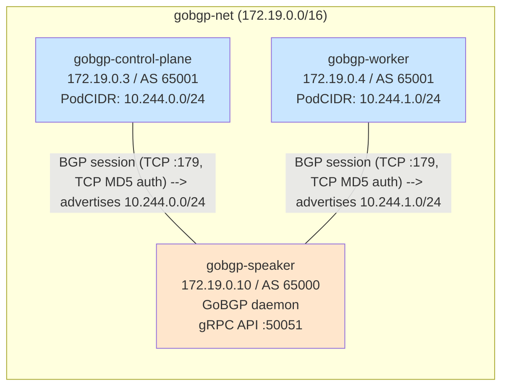

# gobgp-kind-cilium

Local BGP networking lab running Cilium as a Kubernetes CNI with BGP Control
Plane, peered with an external BGP speaker over a shared Docker network.



## What this does

- Spins up a 2-node Kubernetes cluster (v1.33) using [kind][kind]
- Replaces the default CNI and kube-proxy with Cilium (eBPF)
- Enables Cilium's BGP Control Plane (AS 65001) to advertise Pod CIDRs and
  LoadBalancer Service IPs via BGP
- Uses Cilium's LB IPAM (`CiliumLoadBalancerIPPool`, range 172.19.0.200-220) to
  allocate LoadBalancer IPs — creating a `type: LoadBalancer` Service
  automatically produces a route in GoBGP's RIB
- Runs a GoBGP speaker (AS 65000) on a shared Docker L2 bridge, peering with
  Cilium on every node
- Ships with Hubble for observability (UI, relay, agent)

## Prerequisites

| Tool    | Minimum version | Purpose                        |
|---------|-----------------|--------------------------------|
| Docker  | 20.10+          | Run kind nodes as containers   |
| kind    | 0.32.0          | Create local K8s cluster       |
| kubectl | 1.33+           | Interact with the cluster      |
| helm    | 3.x             | Install Cilium                 |
| make    | (any)           | Orchestrate lifecycle          |

Install kind: https://kind.sigs.k8s.io/docs/user/quick-start/#installation

## Quick start

```sh
# Bring up the full lab (cluster + Cilium + BGP auth secret + CRDs + GoBGP speaker)
make up

# Check it's all healthy
make status
make cilium-status
make gobgp-status
make gobgp-routes

# Open Hubble UI
make hubble-ui
# Visit http://localhost:12000
```

## Make targets

```
  make up              Full bring-up: cluster + cilium + auth + BGP CRDs + speaker
  make cluster-up      Bring up just the kind cluster (no cilium/gobgp)
  make down            Tear down the kind cluster (also stops gobgp speaker)
  make status          Show cluster nodes, containers, networks
  make ps              Show running containers
  make logs            Tail controller logs

  make cilium-install  Install or upgrade Cilium via Helm
  make cilium-status   Run `cilium status --brief`
  make hubble-ui       Port-forward Hubble UI to :12000

  make gobgp-up        Start the GoBGP speaker (background)
  make gobgp-down      Stop and remove the GoBGP speaker
  make gobgp-apply     Apply Cilium BGP CRDs to the cluster
  make gobgp-auth-secret  Create/update the k8s TCP MD5 secret
  make lb-pool-apply   Apply CiliumLoadBalancerIPPool for LB IPAM
  make gobgp-status    Show GoBGP neighbor state
  make gobgp-routes    Show routes learned by GoBGP

  make net-create      Create the shared gobgp-net network
  make net-rm          Remove the shared network

  make clean           Tear down cluster + remove network + wipe kubeconfig
  make kubeconfig      Print path to kubeconfig
```

## Network layout

```
  Port forwards:
    localhost:6443  →  kube-apiserver
    localhost:12000 →  Hubble UI
    localhost:50051 →  GoBGP gRPC API

  Docker networks:
    gobgp-kind     172.18.0.0/16  Dedicated bridge for cluster management
                                  (isolated from other kind clusters)
    gobgp-net      172.19.0.0/16  Shared bridge for BGP peering

  Pod CIDR:     10.244.0.0/16
  Service CIDR: 10.96.0.0/16

  BGP participants (all on gobgp-net):
    gobgp-control-plane  172.19.0.3  AS 65001  PodCIDR: 10.244.0.0/24
    gobgp-worker         172.19.0.4  AS 65001  PodCIDR: 10.244.1.0/24
    gobgp-speaker        172.19.0.10 AS 65000
```

## BGP peering

Cilium's BGP Control Plane on each node peers with the GoBGP speaker over
the shared `gobgp-net` L2 bridge. Each kind cluster gets its own Docker
bridge (this one uses `gobgp-kind`) to avoid L2 exposure to other clusters
on the host. The speaker learns PodCIDR routes and stores them in its RIB
(Routing Information Base):

```
GoBGP RIB (current):
  10.244.0.0/24 → 172.19.0.3  AS 65001    (gobgp-control-plane)
  10.244.1.0/24 → 172.19.0.4  AS 65001    (gobgp-worker)
```

### Manifests (`manifests/cilium-bgp.yaml`)

| Resource | Purpose |
|----------|---------|
| `CiliumBGPPeerConfig/gobgp-default` | Peer settings + IPv4 families with ad selector `advertise: bgp` |
| `CiliumBGPClusterConfig/gobgp-bgp` | BGP instance AS 65001, peer to 172.19.0.10 AS 65000 |
| `CiliumBGPAdvertisement/gobgp-advert` | Labeled `advertise: bgp`; advertises PodCIDR + Service LoadBalancerIP |
| `CiliumLoadBalancerIPPool/gobgp-lb-pool` | IP pool 172.19.0.200-220 for LB Service IP allocation (`cilium-lb-pool.yaml`) |


### GoBGP config (`gobgp/gobgpd.toml`)

Local AS 65000, router ID 172.19.0.10. Two neighbors: 172.19.0.3
(gobgp-control-plane) and 172.19.0.4 (gobgp-worker), both AS 65001, TCP MD5
auth enabled. Default accept policy for import and export.

### Verifying LB route advertisement

`make up` applies the IP pool automatically. To test the full path:

```sh
# 1. Apply the sample LoadBalancer Service
kubectl apply -f manifests/svc-lb.yaml

# 2. Check the Service got an IP from the pool
kubectl get svc test-lb
# EXTERNAL-IP column should be 172.19.0.200 (not <pending>)

# 3. Check GoBGP learned the route
make gobgp-routes
# → 172.19.0.200/32 via 172.19.0.3 and 172.19.0.4 (ECMP next-hops)
```

The route is advertised even without matching pods — BGP is "up" but traffic
blackholes until pods exist. The Deployment bundled in the same manifest
creates nginx pods that match the Service selector, so the full path works
immediately after `kubectl apply`.

See [`findings.md`](findings.md) for ECMP behavior and endpoint health details.

## Cluster details

```
  Cluster name:  gobgp
  Nodes:         1 control-plane + 1 worker
  Image:         kindest/node:v1.33.0
  CNI:           Cilium (kindnet disabled)
  kube-proxy:    disabled (eBPF replacement)
  Kubeconfig:    ./.kubeconfig/kubeconfig.yaml
```

## Cilium configuration

Cilium is installed with these key settings:

| Setting                      | Value    | Why                                   |
|------------------------------|----------|---------------------------------------|
| `kubeProxyReplacement`       | true     | Replace kube-proxy with eBPF          |
| `bgpControlPlane.enabled`    | true     | Enable BGP Control Plane              |
| `hubble.enabled`             | true     | Observe traffic flows                 |
| `hubble.relay.enabled`       | true     | Aggregate Hubble data across nodes    |
| `hubble.ui.enabled`          | true     | Web UI for Hubble                     |
| `ipam.mode`                  | kubernetes | Use K8s pod CIDR allocation         |
| `bpf.masquerade`             | true     | eBPF-based masquerading (perf)        |

## Cleanup

```sh
make clean   # removes cluster + network
```

[kind]: https://kind.sigs.k8s.io
