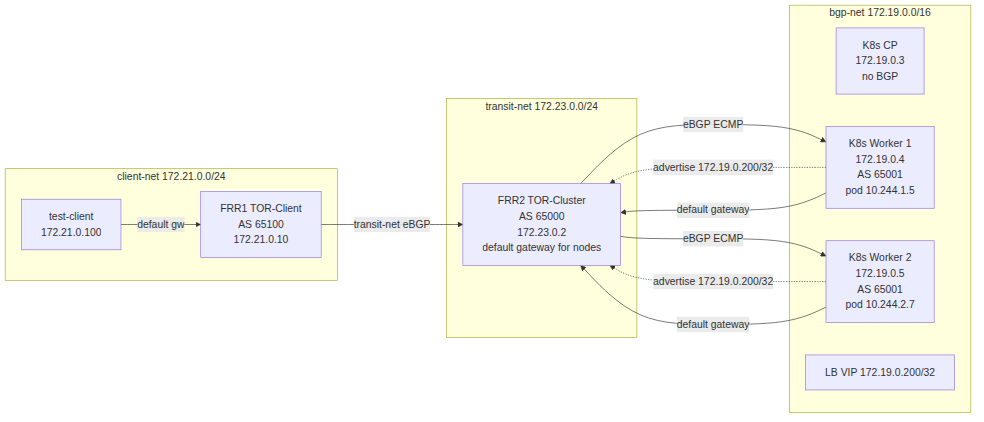

# bgp-kind-cilium

Local BGP networking lab using Cilium in **native routing mode** (no overlay
tunnel) with BGP Control Plane, peered with an external BGP speaker over a
shared Docker network.


Traffic flow (native routing end-to-end, no tunnel):
1. client → FRR1 (default gateway)
2. FRR1 → FRR2 (transit-net eBGP)
3. FRR2 → Cilium node (bgp-net eBGP ECMP)
4. Cilium SNAT → backend pod (direct host-network routing, no Geneve)
5. response via SNAT un-NAT → FRR2 (default gateway) → FRR1 → client

## What this does

- Spins up a 2-node Kubernetes cluster (v1.33) using [kind][kind]
- Replaces the default CNI and kube-proxy with Cilium (eBPF), using
  **native routing** — no Geneve/VXLAN tunnel, Pod IPs are directly routable
- Enables Cilium's BGP Control Plane (AS 65001) to advertise LoadBalancer
  Service IPs and PodCIDRs via BGP
- Uses Cilium's LB IPAM (`CiliumLoadBalancerIPPool`, range 172.19.0.200-220) to
  allocate LoadBalancer IPs — creating a `type: LoadBalancer` Service
  automatically produces a route in FRR's RIB
- Runs two FRR instances: **FRR2 (TOR-Cluster, AS 65000)** peers with Cilium on
  every node, while **FRR1 (TOR-Client, AS 65100)** acts as the test client's default
  gateway. FRR ships bgpd+zebra together, so routes are installed into the
  kernel FIB for local reachability.
- Ships with Hubble for observability (UI, relay, agent)

## Prerequisites

| Tool    | Minimum version | Purpose                        |
|---------|-----------------|--------------------------------|
| Docker  | 20.10+          | Run kind nodes as containers   |
| kind    | 0.32.0          | Create local K8s cluster       |
| kubectl | 1.33+           | Interact with the cluster      |
| helm    | 3.x             | Install Cilium                 |
| make    | (any)           | Orchestrate lifecycle          |

Install kind: https://kind.sigs.k8s.io/docs/user/quick-start/#installation

## Quick start

```sh
# Bring up the full lab (cluster + Cilium + BGP auth secret + CRDs + both FRR speakers)
make up

# Check it's all healthy
make status
make cilium-status
make frr-status    # FRR2 TOR-Cluster BGP summary
make frr-routes    # FRR2 TOR-Cluster RIB
make frr1-routes   # FRR1 TOR-Client RIB (LB VIP should appear here too)

# Open Hubble UI
make hubble-ui
# Visit http://localhost:12000
```

## Make targets

```
  make up              Full bring-up: cluster + cilium + auth + BGP CRDs + both FRR speakers + test client
  make cluster-up      Bring up just the kind cluster (no cilium/frr)
  make down            Tear down the kind cluster (also stops frr speaker and test client)
  make status          Show cluster nodes, containers, networks
  make ps              Show running containers
  make logs            Tail controller logs

  make cilium-install  Install or upgrade Cilium via Helm
  make cilium-status   Run `cilium status --brief`
  make hubble-ui       Port-forward Hubble UI to :12000

  make frr-up          Start both FRR speakers (TOR-Client + TOR-Cluster)
  make frr1-up         Start FRR TOR-Client only
  make frr2-up         Start FRR TOR-Cluster only
  make frr-down        Stop both FRR speakers
  make bgp-apply     Apply Cilium BGP CRDs to the cluster
  make bgp-auth-secret  Create/update the k8s TCP MD5 secret
  make lb-pool-apply   Apply CiliumLoadBalancerIPPool for LB IPAM
  make svc-apply       Apply the sample LoadBalancer Service + Deployment
  make frr-status      Show FRR TOR-Cluster BGP summary (alias for frr2-status)
  make frr-routes      Show FRR TOR-Cluster RIB (alias for frr2-routes)
  make frr1-status     Show FRR TOR-Client BGP summary
  make frr1-routes     Show FRR TOR-Client RIB
  make frr2-status     Show FRR TOR-Cluster BGP summary
  make frr2-routes     Show FRR TOR-Cluster RIB

  make client-up       Start the test client
  make client-down     Stop the test client
  make client-test     Curl the LB VIP from the test client
  make client-route-add  Add client-net default route via FRR1

  make net-create      Create the shared bgp-net, transit-net, client-net networks
  make net-rm          Remove all networks

  make clean           Tear down cluster + remove network + wipe kubeconfig
  make kubeconfig      Print path to kubeconfig
```

## Network layout

```
  Port forwards:
    localhost:6443  →  kube-apiserver
    localhost:12000 →  Hubble UI

  Docker networks:
    bgp-net      172.19.0.0/16  Server L2: Cilium nodes + FRR2 TOR-Cluster (default gateway)
    transit-net  172.23.0.0/24  Transit L2: FRR2 TOR-Cluster ↔ FRR1 TOR-Client (isolated)
    client-net   172.21.0.0/24  Client L2: FRR1 TOR-Client + test client (isolated)

  Pod CIDR:     10.244.0.0/16
  Service CIDR: 10.96.0.0/16

  L2 segments and participants:

    bgp-net (172.19.0.0/16):
      overlay-l3-bgp-control-plane  172.19.0.3  AS 65001  (BGP CP excluded)
      overlay-l3-bgp-worker         172.19.0.4  AS 65001  Cilium BGP CP
      overlay-l3-bgp-worker2        172.19.0.5  AS 65001  Cilium BGP CP
      frr2 TOR-Cluster (frr-speaker)     172.19.0.10 AS 65000  bgpd+zebra, default gateway

    transit-net (172.23.0.0/24):
      frr2 TOR-Cluster (frr-speaker)     172.23.0.2  AS 65000
      frr1 TOR-Client (frr-speaker-tor)    172.23.0.1  AS 65100

    client-net (172.21.0.0/24):
      frr1 TOR-Client (frr-speaker-tor)    172.21.0.10 AS 65100  client gateway
      test-client                   172.21.0.100          curl LB VIP
```

## BGP peering

Two FRR instances form a two-hop BGP path from the client to the K8s
cluster:

- **FRR2 (TOR-Cluster, AS 65000)**: peers with Cilium's BGP Control Plane on
  each kind node over `bgp-net`. Learns LB VIP routes and installs them
  into the kernel FIB via zebra.
- **FRR1 (TOR-Client, AS 65100)**: peers with FRR2 only. Advertises `client-net`
  (172.21.0.0/24) to FRR2 for the return path and learns the LB VIP
  from FRR2.

LB VIP propagation:
```
Cilium (AS 65001) ──→ FRR2 TOR-Cluster (AS 65000) ──→ FRR1 TOR-Client (AS 65100) ──→ FIB
```

### Manifests (`manifests/cilium-bgp.yaml`)

| Resource | Purpose |
|----------|---------|
| `CiliumBGPPeerConfig/overlay-l3-bgp-default` | Peer settings + IPv4 families with ad selector `advertise: bgp` |
| `CiliumBGPClusterConfig/overlay-l3-bgp-bgp` | BGP instance AS 65001, peer to 172.19.0.10 AS 65000 |
| `CiliumBGPAdvertisement/overlay-l3-bgp-advert` | Labeled `advertise: bgp`; advertises Service LoadBalancerIP |
| `CiliumLoadBalancerIPPool/overlay-l3-bgp-lb-pool` | IP pool 172.19.0.200-220 for LB Service IP allocation (`cilium-lb-pool.yaml`) |


### FRR configs

**FRR2 TOR-Cluster** (`frr/frr.conf`): Local AS 65000, router ID 172.19.0.10.
Two Cilium neighbors (172.19.0.4/5, AS 65001, TCP MD5 auth) and one TOR-Client
neighbor (172.23.0.1, AS 65100). Uses `neighbor 172.23.0.1 next-hop-self`
so FRR1 sees the LB VIP's next-hop as FRR2's transit-net IP (172.23.0.2),
forcing all traffic through the TOR-Cluster router. Without this, FRR1 would
learn the Cilium worker IP (172.19.0.x, on a separate L2!) as the next-hop
and attempt to forward traffic directly over transit-net, which doesn't
have those routes — the packet would be dropped. Includes `no bgp
ebgp-requires-policy` to accept routes without explicit policy. Zebra
installs routes into the kernel FIB.

**FRR1 TOR-Client** (`frr/frr1.conf`): Local AS 65100, router ID 172.23.0.1.
Single eBGP peer (172.23.0.2, AS 65000) over transit-net. Advertises
`network 172.21.0.0/24` to FRR2 for the return path.

### Verifying LB route advertisement

`make up` applies the IP pool automatically. To test the full path:

```sh
# 1. Apply the sample LoadBalancer Service
kubectl apply -f manifests/svc-lb.yaml

# 2. Check the Service got an IP from the pool
kubectl get svc test-lb
# EXTERNAL-IP column should be 172.19.0.200 (not <pending>)

# 3. Check FRR2 (TOR-Cluster) learned the route from Cilium
make frr-routes         # alias for make frr2-routes
# → 172.19.0.200/32 via 172.19.0.4 and 172.19.0.5 (ECMP next-hops)

# 4. Check FRR1 (TOR-Client) learned the route from FRR2
make frr1-routes
# → 172.19.0.200/32 via 172.23.0.2 (next-hop = FRR2 TOR-Cluster on transit-net)

# 5. Verify kernel routes on both FRRs
docker exec frr-speaker ip route show proto bgp
docker exec frr-speaker-tor ip route show proto bgp

# 6. Test HTTP reachability from FRR2 (TOR-Cluster) — direct bgp-net access
docker exec frr-speaker wget -q -O- http://172.19.0.200 | head -5
```

The route is advertised even without matching pods — BGP is "up" but traffic
blackholes until pods exist. The Deployment bundled in the same manifest
creates nginx pods that match the Service selector, so the full path works
immediately after `kubectl apply`.

See [Findings](#findings) for ECMP behavior and endpoint health details.

## Findings

Operational and behavioral notes accumulated while building and exercising the
lab.

### F1. Service VIP is advertised by BGP even when no endpoints exist

**What we saw:**
- Created `Service/test-lb` (`type: LoadBalancer`, no matching pods).
- Cilium allocated a `LoadBalancer` IP from
  `CiliumLoadBalancerIPPool/overlay-l3-bgp-lb-pool` (e.g. `172.19.0.200`).
- FRR learned `172.19.0.200/32` with **two ECMP next-hops** (one per node).
- Both nodes had zero local endpoints for the service.

**Why:** `CiliumBGPAdvertisement` advertises the **Service VIP**, not the
Endpoints object. From Cilium's BGP control plane's perspective:
- The Service exists with `type: LoadBalancer` and got an IP from the pool.
- The advertisement config says "advertise `LoadBalancerIP`".
- The BGP daemon does not check whether there are healthy backends before
  pushing the route.

So FRR installs the route, traffic from outside is ECMP'd to both nodes,
hits the kube-proxy replacement (Cilium eBPF), finds no backend, and is
dropped/refused. BGP looks "up", the service is a black hole.

**What to do:**
- Create matching pods before treating the route as functional. Apply the
  sample manifest which already bundles a go-httpbin Deployment:
  ```sh
  make svc-apply   # or: kubectl apply -f manifests/svc-lb.yaml
  ```
  Re-check `make frr-routes` and curl the VIP from the test client.

**How to make BGP honestly reflect endpoint health (advanced, optional):**
- `externalTrafficPolicy: Local` on the Service: a node withdraws its route
  when it has zero local endpoints. Other nodes still advertise.
- Cilium's BGP CP has no built-in "only advertise if endpoints Ready" gate.
  True readiness-aware advertisement requires either an external health
  checker or a custom per-node BGP speaker that watches Endpoints.

**Related:** [Questions §4](#4-will-creating-a-loadbalancer-service-produce-a-bgp-route)
covers the IP-allocation side; this finding covers the endpoint-orthogonal
side.

### F2. ECMP next-hops from both nodes is by design

**What we saw:**
- `docker exec frr-speaker vtysh -c "show bgp ipv4 unicast"` shows the
  same Service prefix with two next-hops: `172.19.0.4` and `172.19.0.5`.

**Why:** Every node in the cluster runs a Cilium BGP instance
(`nodeSelector: {}` in `CiliumBGPClusterConfig/overlay-l3-bgp-bgp`), each
peers with FRR at `172.19.0.10` AS 65000, and each advertises the same
Service because the `CiliumBGPAdvertisement` has no per-node selector. FRR
receives two equal-cost paths and installs both as ECMP next-hops.

**When you DON'T want this:** set `externalTrafficPolicy: Local` on the
Service. A node withdraws its advertisement when it has no local endpoint,
so traffic only lands on a node that has a pod. From FRR's RIB the route
appears from one node only (the one with the local pod).

**Related:** [F1](#f1-service-vip-is-advertised-by-bgp-even-when-no-endpoints-exist).

### F3. Verifying a BGP route end-to-end

Three checks, in order of usefulness:

1. **Service got an IP (LB IPAM working):**
   ```sh
   kubectl --kubeconfig ./.kubeconfig/kubeconfig.yaml get svc test-lb
   # EXTERNAL-IP column should be 172.19.0.200-220, not <pending>
   ```

2. **BGP session is established:**
   ```sh
   make frr-status
   # Each neighbor's state should be "Established"
   ```

3. **Route is in FRR's RIB:**
   ```sh
   make frr-routes
   # or: docker exec frr-speaker vtysh -c "show bgp ipv4 unicast"
   ```
   Look for the Service prefix (e.g. `172.19.0.200/32`) with next-hops on
   `bgp-net` (`172.19.0.4` / `172.19.0.5`).

If 1 passes but 2 fails → Cilium BGP CP can't reach the speaker; check
`authSecretRef` secret, TCP MD5 password match, and `bgp-net` connectivity.
If 2 passes but 3 doesn't show the Service prefix → advertisement selector
isn't matching; verify the `CiliumBGPAdvertisement` and the Service labels.

### F4. (placeholder)

Add more findings as they surface.

## Cluster details

```
  Cluster name:  overlay-l3-bgp
  Nodes:         1 control-plane + 2 workers
  Image:         kindest/node:v1.33.0
  CNI:           Cilium (kindnet disabled)
  kube-proxy:    disabled (eBPF replacement)
  Kubeconfig:    ./.kubeconfig/kubeconfig.yaml
```

## Cilium configuration

Cilium is installed with these key settings:

| Setting                      | Value    | Why                                   |
|------------------------------|----------|---------------------------------------|
| `kubeProxyReplacement`       | true     | Replace kube-proxy with eBPF          |
| `bgpControlPlane.enabled`    | true     | Enable BGP Control Plane              |
| `hubble.enabled`             | true     | Observe traffic flows                 |
| `hubble.relay.enabled`       | true     | Aggregate Hubble data across nodes    |
| `hubble.ui.enabled`          | true     | Web UI for Hubble                     |
| `ipam.mode`                  | kubernetes | Use K8s pod CIDR allocation         |
| `bpf.masquerade`             | true     | eBPF-based masquerading (perf)        |
| `devices`                    | {eth1}  | Single upstream NIC on bgp-net       |
| `loadBalancer.mode`          | snat     | Source NAT for LB traffic (no DSR)    |
| `routingMode`                | native   | Native routing, no overlay            |
| `ipv4NativeRoutingCIDR`      | 10.244.0.0/16 | PodCIDR for native routing        |

Cilium runs in **native routing mode** (`routingMode=native`) — no Geneve
encapsulation. Pod IPs are directly routable on the host network. Cilium
advertises both PodCIDRs and LB VIPs to FRR2 via BGP, enabling the return
path for pod-initiated connections.

The `devices` option lists `eth1` only — all traffic (BGP peering, LB, pod
inter-node, apiserver) flows through `bgp-net`. FRR2 is the default gateway,
so kind nodes don't need a separate management bridge.

## Failover testing

BGP failover time was measured using three isolation methods to understand
how the setup behaves under different failure scenarios.

### Methodology

1. **`docker kill <worker>`** — Instantly tears down the veth pair. FRR zebra
   receives immediate netlink notification and removes the dead nexthop from
   the FIB. Result: ~50ms failover. Unrealistic — no real failure behaves
   this way.

2. **`docker pause <worker>`** — Freezes all processes in the worker
   container, including cilium-agent. The eBPF data plane continues
   forwarding traffic via native routing unaffected. Result: **zero packet
   loss**. Cilium's eBPF programs run in kernel space and survive user-space
   agent death.

3. **iptables isolation** — Simulates a network partition by adding
   `iptables -A INPUT -s 172.19.0.10 -j DROP` and
   `iptables -A OUTPUT -d 172.19.0.10 -j DROP` on the worker. FRR's TCP
   connection monitoring detects the path failure before the BGP hold timer
   expires. Result: ~5s failover detection, 1 dropped TCP connection during
   transition.

| Method | Failover time | Realism |
|--------|--------------|---------|
| `docker kill` | ~50ms | Low (veth teardown is instant) |
| `docker pause` | 0ms (no loss) | Medium (eBPF survives) |
| iptables DROP | ~5s | High (network partition) |

### BGP timers

FRR's hold timer was tuned from default 90s to 9s to reduce failover time:

```
neighbor 172.19.0.4 timers 3 9
```

Timer changes require a BGP session reset (`clear bgp 172.19.0.4`) to take
effect — timer negotiation occurs in the BGP OPEN message.

### BFD support

Cilium's BGP Control Plane does **not** support BFD in version 1.19.x. The
`CiliumBGPPeerConfig` CRD rejects BFD fields and does not expose timer
configuration. Alternatives for faster failover:

- Tune BGP timers (as above)
- Use FRR zebra's nexthop tracking (automatic on Linux)
- Deploy an external FRR router with BFD support as the BGP speaker

### Key takeaways

- Realistic failover testing requires simulating a network partition
  (iptables DROP), not killing or pausing the container.
- The eBPF data plane is independent of the cilium-agent user-space
  process — forwarding continues during agent failure.
- Without BFD, BGP hold timer (default 90s, tuned to 9s) determines failover
  upper bound.
- TCP failure detection can trigger faster than the hold timer (~5s in this
  test).

## Questions

*From `QUESTIONS.md` — a running list of architectural / operational
questions for this lab, with the current answer and a "why it matters" note.*

### 1. Will this setup leak route advertisements or peer with other nodes? Do we have authentication?

**Short answer: it won't leak, and auth is applied.**

#### Why it doesn't leak

- **FRR2 (TOR-Cluster) is configured with three static neighbors**
  (`172.19.0.4`, `172.19.0.5`, `172.23.0.1` for FRR1) in `frr/frr.conf`. It
  does not run `bgp listen Range` and only accepts inbound connections from
  configured neighbors. So it cannot accidentally accept a peer from a host
  on the Docker bridge.
- **Cilium is configured with one static peer** (`172.19.0.10` AS 65000) in
  `manifests/cilium-bgp.yaml` (`CiliumBGPClusterConfig/overlay-l3-bgp-bgp`).
  It is also an active-mode initiator with a fixed peer address — it won't
  accept an inbound session from an unknown neighbor either.
- The speakers live on `bgp-net` (172.19.0.0/16), which is a dedicated
  bridge. To leak, a foreign container would need to be **attached to that
  exact network** (and know the static peer IPs), which is a host-local
  Docker action, not a network event.
- Routes are not exported to any other speaker (FRR has no other neighbors;
  Cilium has no other peers).

#### What is NOT set up (the risk surface)

- FRR runs `no bgp ebgp-requires-policy`, so it accepts routes from
  configured neighbors without explicit prefix-list or RPKI validation.
- **No TTL / eBGP-multihop hardening beyond `ebgpMultihop: 1` on Cilium.**
- **`bgp-net` is plain bridge L2.** Anyone with access to the Docker daemon
  can `docker network connect bgp-net <any-container>` and impersonate either
  peer. On a multi-tenant host, that's a real concern.

#### Why it matters

A BGP speaker on a shared bridge without auth is fine for a single-user
laptop lab (the threat model is "I mess up my own cluster"), but is **not
safe** to run on a shared host, CI runner, or cloud VM where other workloads
can reach the Docker socket. A noisy neighbor or a malicious container could:

1. Open a TCP/179 session to a Cilium worker IP and claim to be
   `172.19.0.10` (no MD5 check would drop it) → inject black-hole routes
   into Cilium → poison the cluster's egress for the prefix it advertises.
2. Accept inbound BGP if `bgp-net` is ever bridged outward and drain the
   Service VIP routes to an external speaker.

#### Mitigations (status)

- ✅ **TCP MD5 auth (RFC 2385) — APPLIED.** `CiliumBGPPeerConfig/overlay-l3-bgp-default`
  references `authSecretRef: bgp-auth`, and the matching k8s Secret
  (in `kube-system`, key `password`) is created by `make bgp-auth-secret`.
  Each `neighbor` block in `frr/frr.conf` sets `password bgp-md5-secret-2026`.
  The lab password is in plaintext — fine for a local lab, replace before
  committing anywhere public. The default Makefile variable is
  `BGP_AUTH_PASSWORD` (override with `make bgp-auth-secret BGP_AUTH_PASSWORD=...`).
- 🟡 Optionally enable RPKI validation on FRR.
- 🟡 Restrict `bgp-net` membership in `docker-compose.yml` (it's already
  exclusive via `external: true`, but no MAC/IP allowlist).

### 1a. Is it possible to add authentication?

**Yes — both sides support TCP MD5 (RFC 2385).**

- **Cilium side:** `CiliumBGPPeerConfig.spec.authSecretRef` references a k8s
  Secret in the BGP secrets namespace (default `kube-system`, configurable
  via `bgpControlPlane.secretNamespace.name`). The Secret must contain a key
  `password`. If the Secret is missing, Cilium logs an error and the session
  proceeds with an empty password (no auth, same as today) — so the Secret
  must be created *before* the PeerConfig references it.
- **FRR side:** `neighbor <addr> password "<value>"` in each neighbor block
  of `frr/frr.conf`. Plain string in the file (mount as a docker-compose
  secret or inject via env if you don't want it on disk).
- **No asymmetric config** — both ends must have the same password or the
  session will fail to come up; Cilium's failure mode is `dial: i/o timeout`
  (the OS-level TCP MD5 mismatch drops SYN segments silently).
- **Caveat:** TCP MD5 signs the TCP header, so the BGP source/destination IP
  seen by each side must match the configured peer address exactly. In this
  lab both sides use the `bgp-net` IP directly, so this is fine.
- **Stronger options (not currently supported by both ends):** TCP-AO
  (RFC 5925) is the successor to MD5 but Cilium BGP and FRR (bgpd) only do
  MD5. For real production, use a dedicated underlay network (no shared L2).

**Status: applied.** See "Mitigations" above — `make bgp-auth-secret`
creates the k8s Secret and `frr/frr.conf` is committed with the matching
password on each Cilium neighbor. To rotate: edit `frr/frr.conf`, change the
password, `make bgp-auth-secret` with the new value, then `make frr-down &&
make frr-up` and let Cilium reconcile.

### 2. Is Cilium in overlay (tunnel) mode? (answered)

**No — native routing.** Cilium is configured with `routingMode=native`
and `devices={eth1}`. Pod-to-pod traffic routes directly on the host
network (no Geneve encapsulation). Cross-node pod traffic flows through
FRR2 (the default gateway).

For L3 service reachability from an external speaker, this means:
- Inbound LB traffic arrives at the node via BGP, Cilium SNATs it to the
  node IP, and the backend pod replies via the node (un-NAT happens on the
  node).
- PodCIDR routes are advertised via BGP so FRR knows how to reach pod IPs
  for the return path of pod-initiated connections.

### 3. Is the setup isolated? (answered, partially)

- `bgp-net` (172.19.0.0/16) is exclusive to this project.
- The **kind Docker network is shared** with the `flux-cluster` cluster on
  the host (both end up on the same `kind` bridge with overlapping CIDRs).
  L2 reachability exists between `overlay-l3-bgp-*` nodes and
  `flux-cluster-control-plane`. Mitigate by giving each kind cluster a
  unique `--network-name` (not currently set in `kind.yaml`).

### 4. Will creating a LoadBalancer Service produce a BGP route?

**Yes, but only if a LoadBalancer IP is actually allocated.** The
`CiliumBGPAdvertisement/overlay-l3-bgp-advert` advertises
`Service/addresses: [LoadBalancerIP]`, and `kind` + plain Cilium do not
ship with a LoadBalancer IPAM controller. `kubectl expose ... --type=
LoadBalancer` will give `EXTERNAL-IP: <pending>` until you install
LB IPAM (`CiliumLoadBalancerIPPool`) or annotate the service manually.

When it does work, the route in FRR2 looks like:

```
172.19.0.200/32  next-hop 172.19.0.{4|5}  AS_PATH 65001  Origin i
```

ECMP happens when pods for the service are on both nodes, but only if
`externalTrafficPolicy: Cluster` (the default). With
`externalTrafficPolicy: Local`, a node withdraws its advertisement when it
has no local endpoint.

The `CiliumBGPAdvertisement` has no `selector` field, so it matches every
LoadBalancer service in the cluster — by design foot-gun for a multi-tenant
cluster; fine for a lab.

## Test client

A permanent Alpine-based test client (`test-client`) lives on a separate
subnet (`client-net`, 172.21.0.0/24) with FRR1 (TOR-Client) as its default
gateway. This provides an isolated client outside `bgp-net` for realistic
end-to-end testing across a two-hop BGP path.

### Topology



Traffic flow:

1. `test-client` sends to LB VIP (172.19.0.200) → default gateway (FRR1 TOR-Client)
2. FRR1 forwards via eBGP-learned route → FRR2 TOR-Cluster
3. FRR2 forwards via eBGP-learned route → Cilium node (ECMP)
4. Cilium SNATs inbound traffic to the node IP → delivers to backend pod via native routing (no tunnel, direct host-network)
5. Pod responds, Cilium un-NATs the reply
6. Return path: node → FRR2 (default gateway) → FRR1 → client

### Usage

```sh
make client-up        # Start the client
make client-down      # Stop the client
make client-test      # curl the LB VIP from the client
docker exec -it test-client sh  # Interactive shell
```

### Requirements

The return path works automatically because FRR2 (172.19.0.10) is the default
gateway for all kind nodes. FRR2 routes return traffic via its eBGP-learned
route to `client-net` (172.21.0.0/24) → FRR1 → test-client.

Inter-node PodCIDR routing also flows through FRR2 by default (native
routing, no encapsulation) — no manual static routes needed.

## Cleanup

```sh
make clean   # removes cluster + network
```

[kind]: https://kind.sigs.k8s.io
